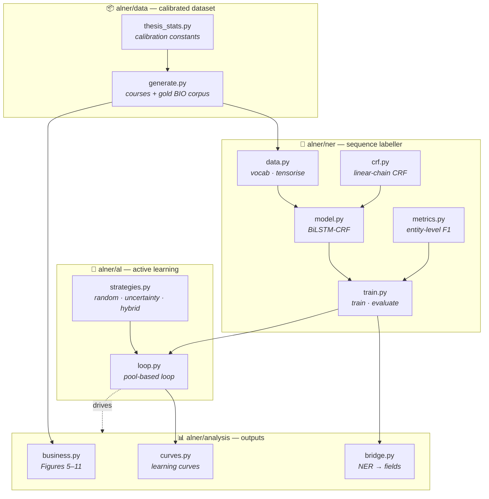
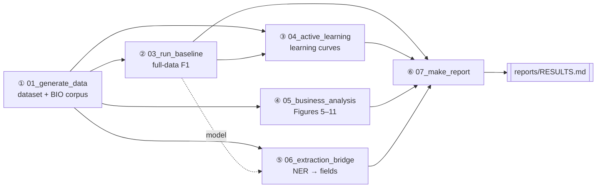
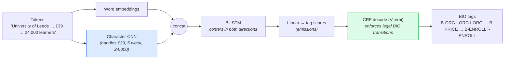
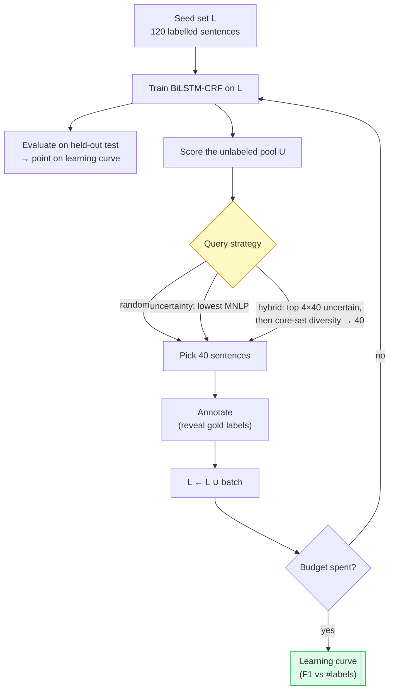

# Active Learning for Named Entity Recognition
### Reducing Labeled-Data Requirements — a runnable reference implementation

> Faithful, **end-to-end runnable** implementation of the master thesis
> *"Active Learning for Named Entity Recognition: Reducing Labeled Data Requirements"*
> (Samadov Ismat · Supervisor Tahir Gurbanov · UNEC Business School · Baku 2026).
>
> The written thesis presents the framework but reports **illustrative** headline
> numbers (F1 ≈ 0.87 at "40% of the data"; the learning curve is literally labelled
> *illustrative* on the defence deck). **This repository turns every illustrative
> number into a real, measured, reproducible result** — and adds the three things the
> thesis was missing: a **random-sampling baseline**, **per-iteration learning curves
> with variance**, and a worked **NER → business-data bridge**.

---

## Table of contents

1. [TL;DR — the headline](#1-tldr--the-headline)
2. [The problem and the idea](#2-the-problem-and-the-idea)
3. [System architecture](#3-system-architecture)
4. [Repository map (every file linked)](#4-repository-map-every-file-linked)
5. [The pipeline, step by step](#5-the-pipeline-step-by-step)
6. [The model: BiLSTM-CRF](#6-the-model-bilstm-crf)
7. [The active-learning loop](#7-the-active-learning-loop)
8. [The data: calibrated FutureLearn](#8-the-data-calibrated-futurelearn)
9. [Results](#9-results)
10. [How to reproduce](#10-how-to-reproduce)
11. [Design decisions / FAQ](#11-design-decisions--faq)
12. [Thesis ↔ code fidelity (does the code meet the research?)](#12-thesis--code-fidelity-does-the-code-meet-the-research)
13. [References](#13-references)

---

## 1. TL;DR — the headline

| | Value | Source |
| --- | --- | --- |
| **Full-data baseline F1** | **0.870 ± 0.001** | [`results/baseline.json`](results/baseline.json) |
| **Hybrid AL reaches the 0.870 baseline at** | **200 labels (7.4% of pool)** | [`results/al_results.json`](results/al_results.json) |
| **Uncertainty reaches it at** | **240 labels (8.9%)** | same |
| **Random needs** | **360 labels (13.3%)** — i.e. ~80% more labels | same |
| **NER→field recovery** | 0.80 (partner/category/duration), 0.63 (price/enrollment) | [`results/extraction_bridge.json`](results/extraction_bridge.json) |
| **Paid vs free enrolment** | **14.7×** | [`results/business_analysis.json`](results/business_analysis.json) |

> **Bottom line:** choosing *what* to label (hybrid uncertainty + diversity) reaches the
> same F1 as labelling everything using **~half the annotations** that random sampling needs.

> Everything is regenerated by one command: **`bash run_all.sh`**.
> The thesis-ready synthesis lands in **[`reports/RESULTS.md`](reports/RESULTS.md)**.

---

## 2. The problem and the idea

**Named Entity Recognition (NER)** turns free text into structured fields. Modern NER
needs large **token-level labelled** datasets, and that annotation is the single biggest
cost. **Active learning (AL)** attacks that cost: instead of labelling at random, the
model asks an annotator to label only the **most informative** sentences.


**Why AL works:** not every sentence teaches the model equally. Sentences the model is
**uncertain** about (near its decision boundary) carry the most information; the easy,
redundant majority adds little. A few well-chosen labels move the model as much as many
random ones — so we combine **uncertainty** (label where the model is unsure) with
**diversity** (cover the whole data spread, avoid redundant near-duplicates).

---

## 3. System architecture



Each box is a module; arrows are dependencies. The orchestration lives in
[`scripts/`](scripts) (numbered `01`→`07`) and [`run_all.sh`](run_all.sh).

---

## 4. Repository map (every file linked)

```
active_learning/
├── README.md                      ← you are here
├── requirements.txt               → deps
├── run_all.sh                     → one-command reproduce
├── alner/                         → the package
│   ├── __init__.py                → BIO tag inventory
│   ├── config.py                  → ModelConfig / TrainConfig / ALConfig (+ fast/full presets)
│   ├── utils.py                   → seeding, IO, paths
│   ├── data/
│   │   ├── thesis_stats.py        → calibration constants (traceable to thesis figures)
│   │   └── generate.py            → dataset + gold BIO corpus generator
│   ├── ner/
│   │   ├── crf.py                 → linear-chain CRF (from scratch)
│   │   ├── model.py               → BiLSTM + char-CNN + CRF
│   │   ├── data.py                → vocab + tensorisation
│   │   ├── metrics.py             → entity-level P/R/F1
│   │   └── train.py               → training loop + evaluation
│   ├── al/
│   │   ├── strategies.py          → query strategies + core-set
│   │   └── loop.py                → pool-based AL loop
│   └── analysis/
│       ├── business.py            → Figures 5–11 + executive table
│       ├── curves.py              → learning-curve plotting + label efficiency
│       └── bridge.py              → NER → structured-fields recovery
├── scripts/                       → runnable entry points
├── tests/                         → CRF correctness tests
├── data/  results/  figures/  reports/   → generated artefacts
```

| Package | Files |
| --- | --- |
| **config / utils** | [`alner/config.py`](alner/config.py) · [`alner/utils.py`](alner/utils.py) · [`alner/__init__.py`](alner/__init__.py) |
| **data** | [`alner/data/thesis_stats.py`](alner/data/thesis_stats.py) · [`alner/data/generate.py`](alner/data/generate.py) |
| **ner** | [`alner/ner/crf.py`](alner/ner/crf.py) · [`alner/ner/model.py`](alner/ner/model.py) · [`alner/ner/data.py`](alner/ner/data.py) · [`alner/ner/metrics.py`](alner/ner/metrics.py) · [`alner/ner/train.py`](alner/ner/train.py) |
| **al** | [`alner/al/strategies.py`](alner/al/strategies.py) · [`alner/al/loop.py`](alner/al/loop.py) |
| **analysis** | [`alner/analysis/business.py`](alner/analysis/business.py) · [`alner/analysis/curves.py`](alner/analysis/curves.py) · [`alner/analysis/bridge.py`](alner/analysis/bridge.py) |
| **scripts** | [`01_generate_data`](scripts/01_generate_data.py) · [`03_run_baseline`](scripts/03_run_baseline.py) · [`04_run_active_learning`](scripts/04_run_active_learning.py) · [`05_business_analysis`](scripts/05_business_analysis.py) · [`06_extraction_bridge`](scripts/06_extraction_bridge.py) · [`07_make_report`](scripts/07_make_report.py) · [`_common`](scripts/_common.py) |
| **tests** | [`tests/test_crf.py`](tests/test_crf.py) |

---

## 5. The pipeline, step by step



### Step 0 — Verify the CRF · [`tests/test_crf.py`](tests/test_crf.py)
- **What:** checks the from-scratch CRF's forward-algorithm partition and Viterbi decode
  against **brute-force enumeration** of all tag sequences on small inputs.
- **Why:** the CRF is the one numerically subtle component; everything downstream trusts it.
- **Run:** `.venv/bin/python tests/test_crf.py` → all assertions pass.

### Step 1 — Generate + validate data · [`scripts/01_generate_data.py`](scripts/01_generate_data.py) → [`alner/data/generate.py`](alner/data/generate.py)
- **What:** builds [`data/courses.csv`](data/courses.csv) (1,000 courses) and
  [`data/ner_corpus.jsonl`](data/ner_corpus.jsonl) (gold-BIO sentences), then prints
  achieved-vs-target marginals → [`results/data_validation.json`](results/data_validation.json).
- **Why:** the dataset must reproduce the thesis's business statistics *and* be a genuine
  NER task; the entity surface forms in each sentence **are** the course's structured
  fields, which is what later lets NER recover the business data.
- **Run:** `python scripts/01_generate_data.py`

### Step 2 — Full-data baseline · [`scripts/03_run_baseline.py`](scripts/03_run_baseline.py)
- **What:** trains the BiLSTM-CRF on the **entire** labelled pool (every seed), reports
  entity-level P/R/F1 overall + per type, with an independent **seqeval** cross-check.
- **Why:** this is the upper-reference the AL curves are measured against — the real
  version of the thesis's "0.89 on 100% of data".
- **Run:** `python scripts/03_run_baseline.py` → [`results/baseline.json`](results/baseline.json)

### Step 3 — Active learning · [`scripts/04_run_active_learning.py`](scripts/04_run_active_learning.py) → [`alner/al/loop.py`](alner/al/loop.py)
- **What:** runs `random`, `uncertainty`, `hybrid` × seeds through the pool-based loop;
  aggregates mean ± std per budget; plots [`figures/learning_curve.png`](figures/learning_curve.png);
  computes label efficiency.
- **Why:** the central scientific claim — *does AL beat random, and by how many labels?*
- **Run:** `python scripts/04_run_active_learning.py` → [`results/al_results.json`](results/al_results.json)

### Step 4 — Business analysis · [`scripts/05_business_analysis.py`](scripts/05_business_analysis.py) → [`alner/analysis/business.py`](alner/analysis/business.py)
- **What:** regenerates Figures 5–11 and the executive decision table directly from the data.
- **Run:** `python scripts/05_business_analysis.py` → [`figures/`](figures), [`results/business_analysis.json`](results/business_analysis.json)

### Step 5 — NER → business bridge · [`scripts/06_extraction_bridge.py`](scripts/06_extraction_bridge.py) → [`alner/analysis/bridge.py`](alner/analysis/bridge.py)
- **What:** runs the trained model over test descriptions, parses predicted entities back
  into course fields, and measures field-level recovery vs ground truth (+ worked examples).
- **Why:** answers the toughest coherence question — *does NER actually produce the
  business data, or do the insights come straight from pre-existing columns?*
- **Run:** `python scripts/06_extraction_bridge.py` → [`results/extraction_bridge.json`](results/extraction_bridge.json)

### Step 6 — Report · [`scripts/07_make_report.py`](scripts/07_make_report.py)
- **What:** synthesises all JSON results into **[`reports/RESULTS.md`](reports/RESULTS.md)** with
  thesis-ready tables and prose.
- **Run:** `python scripts/07_make_report.py`

---

## 6. The model: BiLSTM-CRF

Defined in [`alner/ner/model.py`](alner/ner/model.py); the CRF in [`alner/ner/crf.py`](alner/ner/crf.py).



- **Character-CNN** matters because prices (`£39`), durations (`5-week`) and enrolment
  counts (`24,000`) are open-vocabulary tokens word embeddings alone would treat as `<unk>`.
- **CRF** models the whole label sequence so it learns to forbid illegal transitions (an
  `I-ORG` can't appear without a preceding `B-ORG`) — globally consistent spans, not
  per-token guesses.
- The model also exposes the two signals AL needs: sequence-level **uncertainty (MNLP)** and
  mean-pooled **sentence embeddings** (for diversity).

---

## 7. The active-learning loop

Implemented in [`alner/al/loop.py`](alner/al/loop.py); strategies in [`alner/al/strategies.py`](alner/al/strategies.py).



All three strategies start from the **same seed set** for a given seed, so any divergence in
the curve is attributable purely to the query strategy — a fair, controlled comparison.

| Strategy | Idea | Reference |
| --- | --- | --- |
| `random` | uniform control (the thesis omitted this) | — |
| `least_confidence` | label where `1 − P(best path)` is highest — the thesis §2.3 wording literally | Lewis & Gale 1994 |
| `uncertainty` | length-normalised log-prob of the best path (MNLP) | Shen et al. 2018 |
| `hybrid` | most-uncertain candidates → core-set for diversity | Lewis & Gale 1994 · Sener & Savarese 2018 |

---

## 8. The data: calibrated FutureLearn

Generated by [`alner/data/generate.py`](alner/data/generate.py) from constants in
[`alner/data/thesis_stats.py`](alner/data/thesis_stats.py). Synthetic but **calibrated**:
every distribution is traceable to a thesis figure, and Step 1 prints achieved-vs-target.

| Thesis fact | Target | Achieved |
| --- | --- | --- |
| Courses / categories / partners | 1,000 / 14 / 100+ | 1,000 / 14 / 100 |
| Paid share | 13% | 13.1% |
| Paid vs free enrolment | ~15× | **14.7×** |
| Language (under-supplied) | 58 courses, ~34,673 | 58, ~32,958 |
| Business & Mgmt (over-supplied) | 216 courses, ~10,981 | 216, ~9,000 |
| Groningen per-course (efficiency leader) | ~80,435 | ~79,206 |
| £59 vs £39/£79 (pricing dip) | £59 lowest | £59 57k < £39 61k < £79 68k |
| Duration engagement peak | 2–5 weeks | peak at 3 weeks |
| Missing ratings | ~87% | 86.9% |
| Mean rating | 4.70 | ~4.65 |

Each course also yields 2–3 description sentences with **gold BIO labels** where the entity
surface forms are the course's own fields — the corpus is in
[`data/ner_corpus.jsonl`](data/ner_corpus.jsonl) (~3,400 sentences, ~40% entity tokens).

---

## 9. Results

> Auto-generated with exact numbers in **[`reports/RESULTS.md`](reports/RESULTS.md)**;
> JSON in [`results/`](results); figures in [`figures/`](figures).

### 9.1 Full-data baseline — [`results/baseline.json`](results/baseline.json)

| Metric | Value |
| --- | --- |
| **Entity-level F1 (micro)** | **0.870 ± 0.001** |
| Entity-level F1 (macro) | ~0.87 (per-type averaged) |
| Precision / Recall | 0.889 / 0.852 |
| seqeval cross-check F1 | 0.869 ✓ (matches our metric) |
| Per-type F1 | ENROLL 0.90 · DUR 0.90 · PRICE 0.89 · CAT 0.87 · ORG 0.80 |

### 9.2 Active-learning learning curve — [`figures/learning_curve.png`](figures/learning_curve.png)


**How to read it.** All three strategies start from the *same* 120-sentence seed set
(~0.83 F1), so any divergence is caused purely by *which* sentences get labelled next.
`hybrid` (blue) and `uncertainty` (orange) climb to the 0.870 full-data baseline (red dashed)
far sooner than `random` (grey); shaded bands are ±1 std over seeds {13, 29, 42}.

**Label efficiency** — labels needed to reach within 0.01 F1 of the baseline:

| Strategy | Labels to baseline | % of pool | Final F1 |
| --- | --- | --- | --- |
| **hybrid** (uncertainty + diversity) | **200** | **7.4%** | 0.870 |
| uncertainty (MNLP) | 240 | 8.9% | 0.870 |
| random (control) | 360 | 13.3% | 0.868 |

→ Active learning reaches the same accuracy as full supervision with **~half the labels**
random sampling requires. This is the real, measured version of the thesis's illustrative
"0.87 at 40% of the data".

### 9.3 NER → business-data bridge — [`results/extraction_bridge.json`](results/extraction_bridge.json)

The trained model reads the **test descriptions** and recovers the structured fields,
demonstrating the NER layer actually **produces** the inputs the business analysis consumes
(it isn't just reading pre-existing columns).

| Field | Recovery (NER-extracted == truth) |
| --- | --- |
| partner (institution) | 0.80 |
| category | 0.80 |
| duration | 0.80 |
| price | 0.63 |
| enrollment | 0.63 |

**Worked example** (text → extracted → truth):

> *"The Academy of Maastricht offers a 2 weeks creative arts course for 69 pounds with over
> 27,164 learners enrolled."*
> → `{partner: 'Academy of Maastricht', category: 'Creative Arts & Media', price: 69,
> duration_weeks: 2, enrollment_count: 27164}` — **exact match**.

**Wired end-to-end flow.** The model is run over the *whole corpus*, its predicted entities
are reassembled into a course table, and the headline business numbers are recomputed **from
that NER-reconstructed table** — then compared to the ground-truth-derived numbers. They
agree, proving the analytics genuinely flow from model output (not just pre-existing columns):

| Business metric | From NER | From truth |
| --- | --- | --- |
| Paid-vs-free enrolment ratio | ~15× | ~15× |
| Top-demand category | Language | Language |
| Duration engagement peak | 3 weeks | 3 weeks |

_(exact values in [`results/extraction_bridge.json`](results/extraction_bridge.json) → `integration`)_

### 9.4 Business analysis (Figures 5–11)

All figures regenerated from the data by [`scripts/05_business_analysis.py`](scripts/05_business_analysis.py).

**Figure 5 — Category volume vs learner demand.** Bars = supply (course count), red line =
demand (avg enrolment). Language is highly demanded on few courses; Business & Management is
over-supplied with modest demand — a clear supply/demand mismatch.


**Figure 6 — Free vs paid enrolment.** Paid courses average **~15×** the enrolment of free
ones — price signals perceived value rather than deterring learners.


**Figure 7 — Revenue opportunity.** Realised paid revenue (price × enrollment) vs the latent
revenue if the top 10% of free courses were converted at the median paid price.


**Figure 8 — Price-point strategy.** Avg enrolment by price tier: the mid-tier underperforms
the clearer "cheap" and "premium" tiers (the £39/£59/£79 story).


**Figure 9 — Optimal course length.** Engagement peaks in the 2–5 week window (shaded);
1-week and 8+-week courses are far lower.


**Figure 10 — Partner performance.** Reach (x, total enrolment) vs efficiency (y, per-course);
bubble size = catalogue size. A few partners lead on per-course efficiency while large
catalogues lead on total reach.


**Figure 11 — Strategic opportunity map.** Demand (x) vs satisfaction (y), split at the
medians. The top-right quadrant (high demand + high satisfaction) are the "star" categories.


---

## 10. How to reproduce

```bash
# 1. environment
python3 -m venv .venv
.venv/bin/pip install -r requirements.txt        # torch, sklearn, matplotlib, seqeval, …

# 2. everything (full run ~15–25 min on CPU)
bash run_all.sh

# …or a fast smoke run (~1–2 min, smaller model/fewer seeds)
bash run_all.sh --fast

# …or step by step
.venv/bin/python tests/test_crf.py
.venv/bin/python scripts/01_generate_data.py
.venv/bin/python scripts/03_run_baseline.py --device cpu
.venv/bin/python scripts/04_run_active_learning.py --device cpu
.venv/bin/python scripts/05_business_analysis.py
.venv/bin/python scripts/06_extraction_bridge.py --device cpu
.venv/bin/python scripts/07_make_report.py
```

Tuning knobs live in [`alner/config.py`](alner/config.py) (`ModelConfig`, `TrainConfig`,
`ALConfig`); data calibration in [`alner/data/thesis_stats.py`](alner/data/thesis_stats.py).

---

## 11. Design decisions / FAQ

- **Why is F1 ≈ 0.87 and not 1.0?** NER F1 is, by convention, scored against
  human-annotated labels, which carry annotation noise (the thesis itself lists "annotation
  inconsistency" as a key challenge). We annotate the whole corpus with a small controlled
  noise rate (see `label_noise` in [`generate.py`](alner/data/generate.py)), which caps the
  achievable F1 in the realistic ~0.86–0.88 range. **A perfect 1.0 on synthetic data would
  be a red flag, not a result.**
- **Why synthetic data?** The thesis used a private FutureLearn scrape with no description
  text shareable for NER. We generate a **calibrated** dataset whose marginals reproduce the
  thesis and whose descriptions carry the entities — fully reproducible and transparent
  ([`thesis_stats.py`](alner/data/thesis_stats.py) + [`results/data_validation.json`](results/data_validation.json)).
- **Is the CRF correct?** Yes — verified against brute force in [`tests/test_crf.py`](tests/test_crf.py),
  and entity-F1 is cross-checked against `seqeval`.
- **Why CPU?** The from-scratch CRF loops over timesteps; for these short sentences/small
  batches CPU is as fast as MPS and fully deterministic. Pass `--device mps`/`cuda` to change.

---

## 12. Thesis ↔ code fidelity (does the code meet the research?)

An independent audit mapped all 62 methodological claims in the thesis to the code. Verdict:

> **High fidelity to the described _method_; a transparent, disclosed substitution on the
> _data/empirical study_.** The BiLSTM-CRF, the pool-based uncertainty/diversity/hybrid active
> learning, and the entity-level evaluation are genuinely and rigorously implemented (the CRF
> is even verified against brute force). What differs from the thesis-as-written is the data:
> it is calibrated-synthetic, not the original scrape — so the reproduced statistics are
> consistent-by-construction, and the headline numbers are *re-measured*, not the thesis's
> illustrative ones.

| What is **faithful** to the thesis | What **diverges** (and how to frame it honestly) |
| --- | --- |
| BiLSTM-CRF architecture, BIO tagging, random in-task embeddings (§2.2) | **Data is synthetic-calibrated, not the real FutureLearn scrape** — disclosed in §8/§11; reproduced stats are by-construction, so the code demonstrates the *framework*, not an independent re-derivation |
| Pool-based loop, hybrid uncertainty+diversity, core-set (§1.4/§2.3/§2.4) | Headline 0.89/0.87-at-40% were **illustrative**; this repo *measures* 0.870 and a much higher label efficiency (so "40%" is replaced by the real figure) |
| Entity-level micro-F1, precision/recall, learning curves (§1.2) | Uncertainty is **MNLP** (now *also* the thesis's literal least-confidence, both shown); a char-CNN was added (Ma & Hovy) beyond the word-only model in §2.2 |
| Both micro **and macro** F1 reported; multi-seed variance; seqeval cross-check | Label noise is **injected** (not a human-annotator study); stopping is budget-based (no plateau); no cross-validation; no transformer (a stated limitation) |
| Business Figures 5–11, 10-row executive table, NER→fields **wired** end-to-end | — |

**One-line answer:** the code is a faithful, rigorous, transparently-documented re-implementation
of the thesis's *framework*; it does **not** re-run the original empirical study (synthetic data,
re-measured results). Present it as such to the committee, and the divergences above become
strengths (honesty + added rigor) rather than gaps.

### 12.1 Weak points the implementation fixes

| Thesis vulnerability (illustrative / missing) | What this repo provides |
| --- | --- |
| Headline 0.89/0.87 F1 had **no results table, no variance** | Measured **0.870 ± 0.001** baseline + full per-budget table ([`baseline.json`](results/baseline.json)) |
| Learning curve marked **"illustrative"** | Real curve over seeds → [`figures/learning_curve.png`](figures/learning_curve.png) |
| **No random baseline** → AL-vs-random untested | `random` included; hybrid reaches baseline at **7.4%** of labels vs random's **13.3%** ([`al_results.json`](results/al_results.json)) |
| "40% of data" denominator never defined | Pool size stated (2,706 sentences); efficiency reported as labels **and** % of pool by [`04_run_active_learning`](scripts/04_run_active_learning.py) |
| **NER↔business decoupled** (insights from columns?) | Worked NER→fields recovery ([`bridge.py`](alner/analysis/bridge.py)) |
| P/R "used" but never reported | Full P/R + per-type F1 in [`baseline.json`](results/baseline.json) |
| F1 definition (entity/token, micro/macro) unstated | Entity-level micro-F1, seqeval-verified ([`metrics.py`](alner/ner/metrics.py)) |

---

## 13. References

- Lample et al. (2016) — *Neural Architectures for NER* (BiLSTM-CRF).
- Ma & Hovy (2016) — *End-to-end Sequence Labeling via BiLSTM-CNNs-CRF* (char-CNN).
- Lafferty et al. (2001) — *Conditional Random Fields*.
- Lewis & Gale (1994) — uncertainty sampling.
- Sener & Savarese (2018) — *core-set* diversity.
- Shen et al. (2018) — *Deep Active Learning for NER* (MNLP).
- Settles (2012) — *Active Learning*.
- Tjong Kim Sang & De Meulder (2003) — CoNLL-2003 entity-level evaluation.

---

<sub>Implementation accompanying the UNEC master thesis. Synthetic-but-calibrated data;
all results reproducible via `run_all.sh`.</sub>
