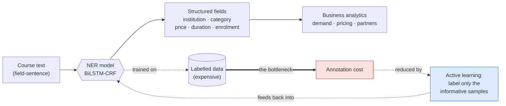
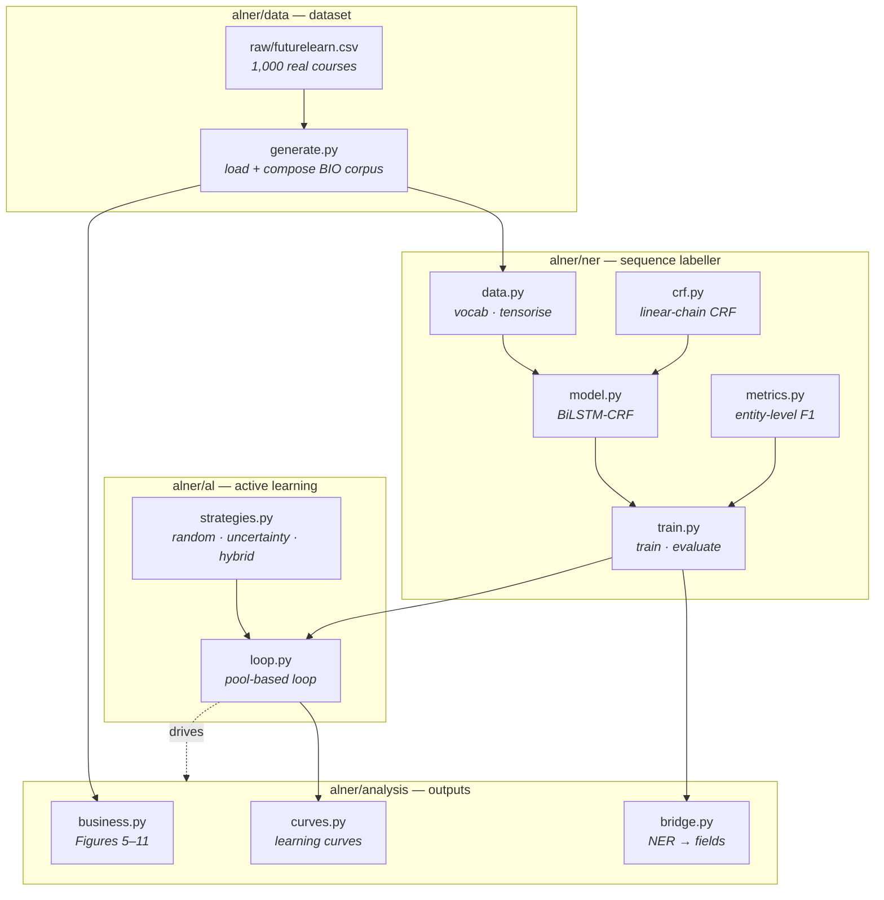
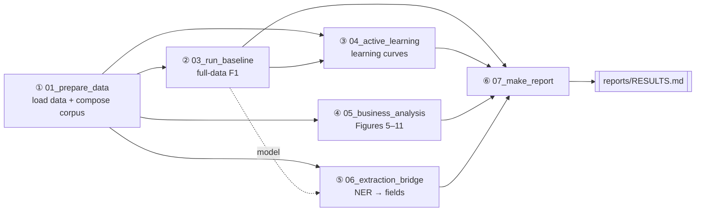
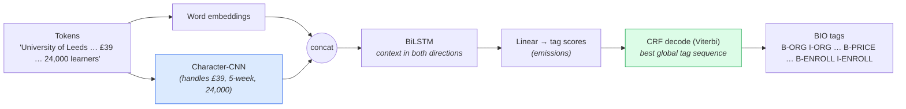
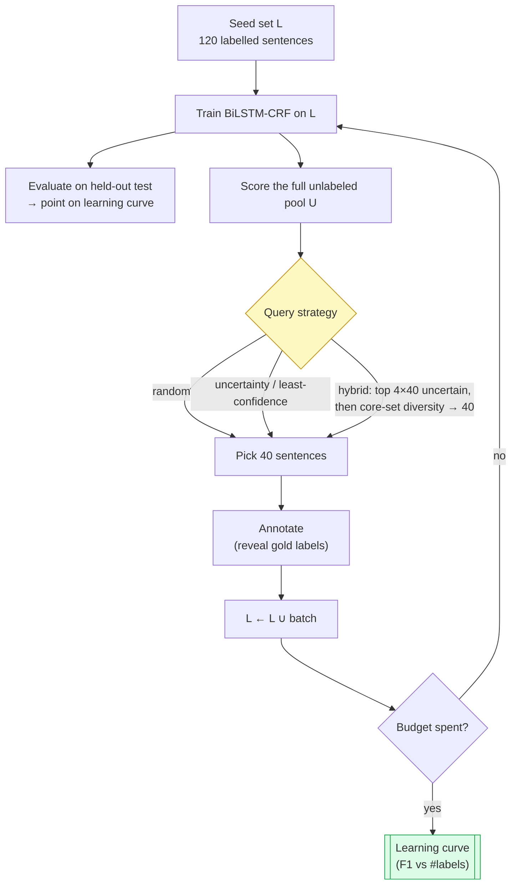

# Active Learning for Named Entity Recognition

### A runnable, reproducible implementation — with an honest account of what it shows

This repository accompanies the master's thesis *"Active Learning for Named Entity
Recognition: Reducing Labeled Data Requirements"* (Samadov Ismat · Supervisor Tahir
Gurbanov · UNEC Business School · Baku 2026). It turns the thesis's framework into
working, end-to-end code: a from-scratch BiLSTM-CRF, a pool-based active-learning loop
with several query strategies, an entity-level evaluation, and a business-analysis layer
over the real FutureLearn dataset.

**Read this first — scope and honesty.** Two things in this repo are real and solid: the
**business dataset and statistics** (1,000 real FutureLearn courses) and the
**implementation** (the CRF is verified against brute force; entity-F1 is cross-checked
against `seqeval`; the whole study reproduces from one command). One thing is **synthetic**:
the NER corpus. Real course descriptions do not contain the structured fields as text, so —
following the thesis's own approach — the labelled sentences are *composed* from each course's
real column values, with the description folded in as non-entity context. Because that task is
**templated and regular, a full BiLSTM-CRF solves it perfectly (test F1 = 1.000)**. So this is
best understood as a **methodology and label-efficiency demonstrator on an easy synthetic task**,
not a hard NER benchmark. The active-learning result — *informative selection reaches the
ceiling with about half the labels random sampling needs* — holds and is measured, but it holds
on that easy task. See [§9 Results](#9-results) and [§11 Limitations](#11-limitations--honest-caveats).

> Everything below is regenerated by one command: **`bash run_all.sh`**. The machine-generated
> synthesis is in **[`reports/RESULTS.md`](reports/RESULTS.md)**; raw numbers in
> [`results/`](results); figures in [`figures/`](figures).

---

## Table of contents

1. [TL;DR — the headline](#1-tldr--the-headline)
2. [The problem and the idea](#2-the-problem-and-the-idea)
3. [System architecture](#3-system-architecture)
4. [Repository map](#4-repository-map)
5. [The pipeline, step by step](#5-the-pipeline-step-by-step)
6. [The model: BiLSTM-CRF](#6-the-model-bilstm-crf)
7. [The active-learning loop](#7-the-active-learning-loop)
8. [The data: real FutureLearn dataset](#8-the-data-real-futurelearn-dataset)
9. [Results](#9-results)
10. [How to reproduce](#10-how-to-reproduce)
11. [Limitations & honest caveats](#11-limitations--honest-caveats)
12. [Relationship to the thesis](#12-relationship-to-the-thesis)
13. [References](#13-references)

---

## 1. TL;DR — the headline

All numbers are measured by `run_all.sh`, averaged over five seeds `{13, 29, 47, 61, 79}`.

| | Value | Source |
| --- | --- | --- |
| Full-data baseline F1 (micro) | **1.0000 ± 0.0000** | [`results/baseline.json`](results/baseline.json) |
| AL reaches the baseline (within 0.01 F1) at | **240 labels — 12.1% of pool** (hybrid / least-confidence) | [`results/al_results.json`](results/al_results.json) |
| Random sampling reaches it at | **480 labels — 24.2% of pool** (~2× the labels) | same |
| NER → field recovery | 1.000 across all six fields | [`results/extraction_bridge.json`](results/extraction_bridge.json) |
| Paid vs free enrolment (real data) | **15.18×** (46,291 vs 3,050) | [`results/business_analysis.json`](results/business_analysis.json) |

> **Bottom line.** On this synthetic, perfectly-learnable task, *choosing which sentences to
> label* still reaches the full-data ceiling with about **half the annotations** random
> sampling needs (≈12% of the pool vs ≈24%). The baseline F1 is 1.000 because the task is easy
> — that is a property of the synthetic corpus, not a benchmark result (see [§11](#11-limitations--honest-caveats)).

---

## 2. The problem and the idea

**Named Entity Recognition (NER)** turns free text into structured fields. Supervised NER needs
large token-level labelled datasets, and that annotation is the dominant cost. **Active learning
(AL)** attacks that cost: instead of labelling at random, the model asks an annotator to label
the **most informative** sentences first.



**Why AL can help:** not every sentence teaches the model equally. Sentences the model is
**uncertain** about carry more information than the easy, redundant majority. Combining
**uncertainty** (label where the model is unsure) with **diversity** (cover the data spread,
avoid near-duplicates) lets a few well-chosen labels move the model as much as many random ones.

---

## 3. System architecture



Each box is a module; arrows are dependencies. Orchestration lives in [`scripts/`](scripts)
(numbered `01`→`07`; there is no `02`) and [`run_all.sh`](run_all.sh).

---

## 4. Repository map

```
active_learning/
├── README.md                      ← you are here
├── requirements.txt               → dependencies
├── run_all.sh                     → one-command reproduce
├── raw/futurelearn.csv            → real dataset (1,000 courses; analisto/futurelearn_com)
├── alner/                         → the package
│   ├── __init__.py                → BIO tag inventory (6 entity types, 13 tags)
│   ├── config.py                  → ModelConfig / TrainConfig / ALConfig (+ fast/full presets)
│   ├── utils.py                   → seeding, IO, paths
│   ├── data/generate.py           → loads raw/futurelearn.csv + composes the BIO corpus
│   ├── ner/
│   │   ├── crf.py                 → linear-chain CRF (from scratch)
│   │   ├── model.py               → BiLSTM + char-CNN + CRF
│   │   ├── data.py                → vocab + tensorisation
│   │   ├── metrics.py             → entity-level P/R/F1 (+ seqeval cross-check)
│   │   └── train.py               → training loop + evaluation
│   ├── al/
│   │   ├── strategies.py          → query strategies + core-set selection
│   │   └── loop.py                → pool-based AL loop
│   └── analysis/
│       ├── business.py            → Figures 5–11 + executive table
│       ├── curves.py              → learning-curve plotting + label efficiency
│       └── bridge.py              → NER → structured-fields recovery
├── scripts/                       → runnable entry points (01, 03–07, _common)
├── tests/test_crf.py              → CRF correctness tests (brute-force + mixed-length batch)
└── data/  results/  figures/  reports/   → generated artefacts
```

| Package | Files |
| --- | --- |
| config / utils | [`alner/config.py`](alner/config.py) · [`alner/utils.py`](alner/utils.py) · [`alner/__init__.py`](alner/__init__.py) |
| data | [`raw/futurelearn.csv`](raw/futurelearn.csv) (real source) · [`alner/data/generate.py`](alner/data/generate.py) |
| ner | [`crf.py`](alner/ner/crf.py) · [`model.py`](alner/ner/model.py) · [`data.py`](alner/ner/data.py) · [`metrics.py`](alner/ner/metrics.py) · [`train.py`](alner/ner/train.py) |
| al | [`strategies.py`](alner/al/strategies.py) · [`loop.py`](alner/al/loop.py) |
| analysis | [`business.py`](alner/analysis/business.py) · [`curves.py`](alner/analysis/curves.py) · [`bridge.py`](alner/analysis/bridge.py) |
| scripts | [`01_prepare_data`](scripts/01_prepare_data.py) · [`03_run_baseline`](scripts/03_run_baseline.py) · [`04_run_active_learning`](scripts/04_run_active_learning.py) · [`05_business_analysis`](scripts/05_business_analysis.py) · [`06_extraction_bridge`](scripts/06_extraction_bridge.py) · [`07_make_report`](scripts/07_make_report.py) · [`_common`](scripts/_common.py) |
| tests | [`tests/test_crf.py`](tests/test_crf.py) |

---

## 5. The pipeline, step by step



**Step 0 — Verify the CRF · [`tests/test_crf.py`](tests/test_crf.py).** Checks the from-scratch
CRF's forward-algorithm partition and Viterbi decode against **brute-force enumeration** of all
tag sequences on small inputs, including a genuine mixed-length batch and a padding-invariance
case. Run: `.venv/bin/python tests/test_crf.py`.

**Step 1 — Prepare data + compose corpus · [`scripts/01_prepare_data.py`](scripts/01_prepare_data.py).**
Loads the real [`raw/futurelearn.csv`](raw/futurelearn.csv), writes
[`data/courses.csv`](data/courses.csv) (normalised) and
[`data/ner_corpus.jsonl`](data/ner_corpus.jsonl), and reports statistics to
[`results/data_validation.json`](results/data_validation.json). The NER sentences are composed
from each course's real field values; the train/test split is **grouped by course** so no
course's surface forms appear on both sides.

**Step 2 — Full-data baseline · [`scripts/03_run_baseline.py`](scripts/03_run_baseline.py).**
Trains the BiLSTM-CRF on the entire pool (every seed), reports entity-level P/R/F1 overall and
per type, with an independent **seqeval** cross-check that is *asserted* in code, not just
printed. → [`results/baseline.json`](results/baseline.json).

**Step 3 — Active learning · [`scripts/04_run_active_learning.py`](scripts/04_run_active_learning.py).**
Runs `random`, `least_confidence`, `uncertainty`, `hybrid` × seeds through the pool-based loop;
aggregates mean ± std per budget; plots [`figures/learning_curve.png`](figures/learning_curve.png);
computes label efficiency. → [`results/al_results.json`](results/al_results.json).

**Step 4 — Business analysis · [`scripts/05_business_analysis.py`](scripts/05_business_analysis.py).**
Regenerates Figures 5–11 and the executive decision table directly from the real data. →
[`figures/`](figures), [`results/business_analysis.json`](results/business_analysis.json).

**Step 5 — NER → business bridge · [`scripts/06_extraction_bridge.py`](scripts/06_extraction_bridge.py).**
Runs the trained model over the test records (entities live in the composed field-sentences;
descriptions are non-entity context), parses predicted entities back into course fields, and
measures field-level recovery vs ground truth. It then reconstructs the whole course table from
model output and recomputes the headline business numbers from it, to confirm the pipeline is
wired end-to-end. → [`results/extraction_bridge.json`](results/extraction_bridge.json).

**Step 6 — Report · [`scripts/07_make_report.py`](scripts/07_make_report.py).** Synthesises all
JSON results into **[`reports/RESULTS.md`](reports/RESULTS.md)**.

---

## 6. The model: BiLSTM-CRF

Defined in [`alner/ner/model.py`](alner/ner/model.py); the CRF in [`alner/ner/crf.py`](alner/ner/crf.py).



- **Character-CNN** matters because prices (`£39`), durations (`5-week`) and enrolment counts
  (`24,000`) are open-vocabulary tokens that word embeddings alone would treat as `<unk>`.
- **CRF** scores whole tag sequences using **learned** pairwise transition scores between tags,
  so Viterbi decoding returns a globally coherent sequence rather than independent per-token
  guesses. Note the transitions are *learned, not hard-constrained* — the model is not
  mechanically prevented from emitting an illegal transition (e.g. `O → I-ORG`), though in
  practice it learns to avoid them; the span-extraction metric is also tolerant of malformed
  sequences in the same way `seqeval`'s default mode is.
- The model also exposes the two signals AL needs: sequence-level **uncertainty (MNLP)** and
  mean-pooled **sentence embeddings** (for diversity).

The from-scratch CRF (`_partition`, `decode`, NLL) is unit-tested against brute-force
enumeration in [`tests/test_crf.py`](tests/test_crf.py).

---

## 7. The active-learning loop

Implemented in [`alner/al/loop.py`](alner/al/loop.py); strategies in
[`alner/al/strategies.py`](alner/al/strategies.py).



All strategies start from the **same seed set** for a given seed, and every strategy scores the
**full** remaining pool each round (no candidate-pool subsampling — applied symmetrically if ever
enabled), so any divergence in the curve is attributable purely to the query strategy. Each round
retrains a fresh model from scratch. The test set is used only to record the learning-curve metric
— never for querying or model selection.

| Strategy | Idea | Reference |
| --- | --- | --- |
| `random` | uniform control (the thesis omitted this) | — |
| `least_confidence` | label where `1 − P(best path)` is highest — the thesis §2.3 wording literally | [Lewis & Gale 1994](https://arxiv.org/abs/cmp-lg/9407020) |
| `uncertainty` | length-normalised log-prob of the best path (MNLP) | [Shen et al. 2018](https://arxiv.org/abs/1707.05928) |
| `hybrid` | most-uncertain candidates → core-set for diversity | [Lewis & Gale 1994](https://arxiv.org/abs/cmp-lg/9407020) · [Sener & Savarese 2018](https://arxiv.org/abs/1708.00489) |

---

## 8. The data: real FutureLearn dataset

The **business data is real** — 1,000 FutureLearn courses from
[**github.com/analisto/futurelearn_com**](https://github.com/analisto/futurelearn_com), vendored
at [`raw/futurelearn.csv`](raw/futurelearn.csv) and loaded by
[`alner/data/generate.py`](alner/data/generate.py). Step 1 prints the statistics:

| Statistic | This dataset |
| --- | --- |
| Courses / categories / partners | 1,000 / 14 / 114 |
| Paid / free | 130 (13%) / 870 (87%) |
| Paid vs free mean enrolment | 46,291 vs 3,050 — **15.18×** |
| Language (under-supplied) | 58 courses, ~34,673 avg enrolment |
| Business & Management (largest catalogue) | 216 courses |
| Engagement peak | 5-week courses (~15,344) |
| Ratings missing | 87.0% |
| `level` field present | 63.9% |

Real `enrolled_count`, `rating` and `level` columns carry real-world missingness.

**Building the NER corpus (synthetic).** Real descriptions are short marketing blurbs that do
**not** contain the structured fields as text. So — as the thesis's own slide-3 example does —
[`generate.py`](alner/data/generate.py) **composes** each course's real field values
(partner → ORG, category → CAT, price → PRICE, duration → DUR, enrolment → ENROLL, level → LEVEL)
into gold-BIO *field-sentences*, and folds the real description in as non-entity (`O`) context.
The result is [`data/ner_corpus.jsonl`](data/ner_corpus.jsonl): **2,477 sentences, 51,090 tokens,
33.5% entity tokens, 13 BIO tags**, split into a **1,985-sentence train pool and a 492-sentence
test set, grouped by course**. A small annotation-noise rate is injected into the **train pool
only** (the test set keeps clean gold); the clean labels are kept in `tags_truth`.

Because the entities live in regular templated sentences, this corpus is **easy** — see the
results and limitations below.

---

## 9. Results

> Machine-generated, with exact numbers, in **[`reports/RESULTS.md`](reports/RESULTS.md)**; JSON
> in [`results/`](results); figures in [`figures/`](figures). Averaged over seeds
> `{13, 29, 47, 61, 79}`.

### 9.1 Full-data baseline — [`results/baseline.json`](results/baseline.json)

| Metric | Value |
| --- | --- |
| Entity-level F1 (micro) | **1.0000 ± 0.0000** |
| Entity-level F1 (macro) | 1.0000 |
| Precision / Recall | 1.0000 / 1.0000 |
| seqeval cross-check | 1.0000 (asserted equal in code) |
| Per-type F1 | ORG · CAT · PRICE · DUR · ENROLL · LEVEL all 1.000 |

The full-data model labels the test set perfectly. This is expected — the task is a regular,
templated synthetic one (see [§11](#11-limitations--honest-caveats)). It is **not** a result
about NER on real prose.

### 9.2 Active-learning learning curve — [`figures/learning_curve.png`](figures/learning_curve.png)


All four strategies start from the **same** 120-sentence seed set (**0.924 ± 0.027** F1), so any
divergence is caused purely by *which* sentences are labelled next. The informativeness-based
strategies climb to the ceiling within a few rounds; random lags and only catches up near the end
of the budget.

**Label efficiency** — labels needed to reach within 0.01 F1 of the full-data baseline (≥ 0.990):

| Strategy | Labels to baseline | % of pool | Final F1 (600 labels) |
| --- | --- | --- | --- |
| **hybrid** (uncertainty + diversity) | **240** | **12.1%** | 0.9984 |
| **least-confidence** (thesis §2.3) | **240** | **12.1%** | 0.9993 |
| **uncertainty** (MNLP) | **280** | **14.1%** | 0.9989 |
| random (control) | 480 | 24.2% | 0.9927 |

→ Informativeness-based selection reaches the full-data ceiling with about **half the labels**
random sampling needs (≈12% of the pool vs ≈24%). The gap is real and consistent across seeds —
but, again, on an easy task where the ceiling itself is F1 = 1.000.

### 9.3 NER → business-data bridge — [`results/extraction_bridge.json`](results/extraction_bridge.json)

The trained model parses entities back out of the composed field-sentences and reassembles them
into structured fields. Because the full-data model is perfect, recovery is exact:

| Field | Recovery (NER-extracted == truth) |
| --- | --- |
| partner · category · price · duration · enrolment · level | **1.000** each |

**What this does and does not show.** It demonstrates the pipeline is **wired end-to-end** — the
business numbers are recomputed from model output, not read from adjacent columns. It does **not**
show extraction of fields from free prose: the entities only ever appear in the composed
field-sentences, and the descriptions are `O`-context. A real worked example produced by the run
(see the `examples` array in [`results/extraction_bridge.json`](results/extraction_bridge.json)):

> *"Develop tools for assessing, managing, and treating pain to help ease distress for palliative
> care patients."* (description context) → `partner: University of Colorado · category:
> Healthcare & Medicine · price: free · duration_weeks: 5 · enrolment: 321` — matches truth.

Reconstructing the whole course table from model output and recomputing the headline business
numbers gives results identical to the ground-truth-derived ones:

| Business metric | From NER | From truth |
| --- | --- | --- |
| Paid-vs-free enrolment ratio | 15.18× | 15.18× |
| Top-demand category | Language | Language |
| Duration engagement peak | 5 weeks | 5 weeks |

_(1,000 courses reconstructed; exact values under `integration` in the JSON.)_

### 9.4 Business analysis (Figures 5–11)

Regenerated from the real data by
[`scripts/05_business_analysis.py`](scripts/05_business_analysis.py).

- **Figure 5 — Category volume vs demand.** Language is highly demanded on few courses; Business
  & Management is over-supplied with modest demand.
  
- **Figure 6 — Free vs paid enrolment.** Paid courses average **~15×** the enrolment of free ones.
  
- **Figure 7 — Revenue opportunity.** Realised paid revenue vs latent revenue if the top 10% of
  free courses converted at the median paid price.
  
- **Figure 8 — Price-point strategy.** Among populated tiers, £59 is strongest (~64,821) and £79
  weakest (~35,891) — reported as the data shows.
  
- **Figure 9 — Course length.** Engagement peaks in the 2–5 week window, at 5 weeks (~15,344).
  
- **Figure 10 — Partner performance.** Reach (total enrolment) vs efficiency (per-course).
  
- **Figure 11 — Strategic opportunity map.** Demand vs satisfaction; the top-right quadrant are
  the "star" categories (Healthcare & Medicine, History, Language, Psychology & Mental Health).
  

---

## 10. How to reproduce

```bash
# 1. environment
python3 -m venv .venv
.venv/bin/pip install -r requirements.txt        # torch, sklearn, matplotlib, seqeval, …

# 2. everything (full run ~50 min on CPU: 5 seeds × 4 strategies × 13 budgets)
bash run_all.sh

# …or a fast smoke run (~2 min, smaller model / 1 seed)
bash run_all.sh --fast

# …or step by step
.venv/bin/python tests/test_crf.py
.venv/bin/python scripts/01_prepare_data.py
.venv/bin/python scripts/03_run_baseline.py --device cpu
.venv/bin/python scripts/04_run_active_learning.py --device cpu
.venv/bin/python scripts/05_business_analysis.py
.venv/bin/python scripts/06_extraction_bridge.py --device cpu
.venv/bin/python scripts/07_make_report.py
```

Determinism: `run_all.sh` exports `PYTHONHASHSEED`, and every script seeds Python/NumPy/PyTorch
via `set_seed`. Runs are deterministic on CPU with `num_workers=0`; GPU/MPS (`--device mps|cuda`)
is faster but not guaranteed bit-identical. Tuning knobs live in
[`alner/config.py`](alner/config.py) (`ModelConfig`, `TrainConfig`, `ALConfig`).

---

## 11. Limitations & honest caveats

This section is the honest counterweight to the headline. None of these are hidden in the code;
they are stated here so the numbers are read correctly.

- **The NER corpus is synthetic and easy.** Entities appear only in templated field-sentences
  composed from the real columns; descriptions are `O`-context. A full BiLSTM-CRF therefore
  reaches **F1 = 1.000**. This repo demonstrates AL *methodology and label efficiency* on that
  task — it is **not** a hard NER benchmark, and the field-recovery 1.000 is template
  round-tripping, not extraction from real prose. A stronger evaluation would need a corpus with
  entities embedded in genuine free text (or a public NER dataset such as CoNLL-2003).
- **Evaluation uses clean test labels.** Earlier versions injected 5% label noise into the test
  set too, which artificially capped F1 near 0.86; that was a measurement artefact and has been
  removed. Annotation noise is now applied to the **train pool only**, and the test set is scored
  against clean gold. The headline 1.000 is the honest accuracy on this (easy) task.
- **The split is grouped by course, but partner strings recur.** Whole courses are held out, so no
  single course's values leak across train/test. Institution names that appear in many courses
  still recur across the split — that is legitimate signal, not leakage, but it contributes to how
  learnable the task is.
- **The active-learning gap is real but modest in absolute terms.** Because the ceiling is 1.000
  and even the seed model is already at ~0.92, the strategies separate over a narrow band. The
  12% vs 24% label-efficiency result holds across five seeds, but it is established on an easy
  task; it should not be over-generalised to hard, real-text NER.
- **Transitions are learned, not constrained.** The CRF does not hard-forbid illegal BIO
  transitions; it learns to avoid them. The entity-F1 metric (and its `seqeval` cross-check) is
  tolerant of malformed sequences, matching `seqeval`'s default (non-strict) mode.
- **Architecture differs slightly from the thesis.** A character-CNN ([Ma & Hovy 2016](https://aclanthology.org/P16-1101/))
  is added on top of the thesis's word-only BiLSTM-CRF. This is a citable, reasonable choice but
  is a deviation, noted for transparency.

---

## 12. Relationship to the thesis

The thesis presents the framework but reports its headline numbers as **illustrative**
(F1 ≈ 0.87 at "40% of the data"; the learning curve is labelled *illustrative* on the defence
deck). This repository turns the framework into runnable, measured code and adds the pieces the
thesis lacked: a **random-sampling baseline**, **per-iteration learning curves with variance over
five seeds**, and a worked **NER → business-data bridge**.

What is genuinely shared with the thesis: the **real FutureLearn dataset** (so the business
statistics match — 46,291 vs 3,050; Language 34,673; 5-week peak; 87% missing ratings), the
**BiLSTM-CRF + pool-based uncertainty/diversity/hybrid AL** method, and **entity-level
evaluation**. What differs or is built rather than borrowed: the **NER corpus is composed** from
the columns (the thesis's own approach — but it means the NER task is synthetic, not a real-text
benchmark), a **character-CNN** is added, and the thesis's illustrative numbers are replaced by
measured ones. The measured numbers are **not** the thesis's (the baseline is 1.000 here, not
0.87) — they are what this implementation actually produces on this synthetic corpus, reported
honestly rather than tuned to match.

| What is shared | What differs / is built |
| --- | --- |
| Real dataset → business stats reproduce | NER labels are *composed* from columns → the NER task is synthetic, not real-text |
| BiLSTM-CRF, BIO tagging, pool-based AL | A char-CNN (Ma & Hovy) is added beyond the word-only model |
| Hybrid uncertainty + diversity (core-set) | A `random` control and 5-seed variance are added (absent in the thesis) |
| Entity-level micro + macro F1, P/R, seqeval check | Illustrative 0.87-at-40% replaced by measured 12% / 24% efficiency at F1 = 1.000 |

---

## 13. References

Every reference below is cited in the thesis **except Ma & Hovy (2016)**, added here for the
character-CNN. Links verified to resolve to the exact work.

| Reference | Used for |
| --- | --- |
| [Lample, Ballesteros, Subramanian, Kawakami & Dyer (2016). *Neural Architectures for Named Entity Recognition.* NAACL-HLT.](https://aclanthology.org/N16-1030/) | the BiLSTM-CRF baseline ([`model.py`](alner/ner/model.py)) |
| [Hochreiter & Schmidhuber (1997). *Long Short-Term Memory.* Neural Computation 9(8).](https://doi.org/10.1162/neco.1997.9.8.1735) | the LSTM cell |
| [Graves & Schmidhuber (2005). *Framewise phoneme classification with bidirectional LSTM…* Neural Networks 18(5–6).](https://doi.org/10.1016/j.neunet.2005.06.042) | bidirectional encoding |
| [Lafferty, McCallum & Pereira (2001). *Conditional Random Fields…* ICML.](https://dblp.org/rec/conf/icml/LaffertyMP01.html) | the CRF layer ([`crf.py`](alner/ner/crf.py)) |
| [Ma & Hovy (2016). *End-to-end Sequence Labeling via Bi-directional LSTM-CNNs-CRF.* ACL.](https://aclanthology.org/P16-1101/) | the character-CNN — **our addition, not in the thesis** |
| [Lewis & Gale (1994). *A Sequential Algorithm for Training Text Classifiers.* SIGIR.](https://arxiv.org/abs/cmp-lg/9407020) | uncertainty / least-confidence sampling ([`strategies.py`](alner/al/strategies.py)) |
| [Sener & Savarese (2018). *Active Learning for Convolutional Neural Networks: A Core-Set Approach.* ICLR.](https://arxiv.org/abs/1708.00489) | diversity (core-set) selection |
| [Shen, Yun, Lipton, Kronrod & Anandkumar (2018). *Deep Active Learning for Named Entity Recognition.* ICLR.](https://arxiv.org/abs/1707.05928) | MNLP sequence-level uncertainty |
| [Settles (2012). *Active Learning.* Synthesis Lectures / Morgan & Claypool.](https://doi.org/10.2200/S00429ED1V01Y201207AIM018) | the pool-based AL framework ([`loop.py`](alner/al/loop.py)) |
| [Tjong Kim Sang & De Meulder (2003). *Introduction to the CoNLL-2003 Shared Task…* CoNLL.](https://aclanthology.org/W03-0419/) | entity-level F1 evaluation ([`metrics.py`](alner/ner/metrics.py)) |

### 13.1 Reference usage map (code ↔ thesis)

For each reference: the idea used, **where it lives in the code** (`file:line`, with an inline
citation comment at that spot), and **where it is cited in the thesis**. Ma & Hovy is the only
one used in code but not in the thesis.

| Reference | Idea used | In the code (file : line) | In the thesis (section · page) |
| --- | --- | --- | --- |
| **Lample et al. (2016)** | BiLSTM-CRF architecture as the NER baseline | [`alner/ner/model.py:22`](alner/ner/model.py#L22) (`BiLSTMCRF`) | §2.2 · p.43; §1.4 · p.32 |
| **Hochreiter & Schmidhuber (1997)** | the LSTM cell | [`alner/ner/model.py:34`](alner/ner/model.py#L34) (`nn.LSTM`) | §2.2 · p.43 |
| **Graves & Schmidhuber (2005)** | bidirectional processing | [`alner/ner/model.py:34`](alner/ner/model.py#L34) (`bidirectional=True`) | §2.2 · p.43 |
| **Lafferty et al. (2001)** | CRF forward-algorithm partition + Viterbi | [`alner/ner/crf.py:25`](alner/ner/crf.py#L25) (`CRF`), `:74` `_partition`, `:90` `decode` | §2.2 · p.43; §1.1 · p.12 |
| **Ma & Hovy (2016)** | the character-CNN over tokens | [`alner/ner/model.py:29`](alner/ner/model.py#L29) (`char_cnn`) | *not in the thesis — our addition* |
| **Lewis & Gale (1994)** | least-confidence query (`1 − P(best path)`) | [`alner/ner/crf.py:144`](alner/ner/crf.py#L144) (`least_confidence`); [`alner/al/strategies.py:86`](alner/al/strategies.py#L86) | §1.3 · p.23; §2.3 · p.45 |
| **Sener & Savarese (2018)** | core-set / k-center-greedy diversity | [`alner/al/strategies.py:47`](alner/al/strategies.py#L47) (`k_center_greedy`) | §1.3 · p.23; §1.4 · p.32 |
| **Shen et al. (2018)** | MNLP length-normalised sequence uncertainty | [`alner/ner/crf.py:137`](alner/ner/crf.py#L137) (`best_path_normalized_logprob`) | §1.3 · p.23 |
| **Settles (2012)** | pool-based AL loop (seed → query → annotate → retrain) | [`alner/al/loop.py:28`](alner/al/loop.py#L28) (`run_active_learning`) | Intro · p.6; §1.3 · p.23 |
| **Tjong Kim Sang & De Meulder (2003)** | entity-level (CoNLL) F1 + BIO scheme | [`alner/ner/metrics.py:16`](alner/ner/metrics.py#L16) (`bio_spans`), `:37` `prf` | §1.2 · p.17; §2.1 · p.36 |

> Page numbers are from the thesis Table of Contents. The `#L<n>` anchors open the exact code
> line on GitHub.

---

<sub>Implementation accompanying the UNEC master thesis. The business dataset is real
([analisto/futurelearn_com](https://github.com/analisto/futurelearn_com)); the NER corpus is
synthetic (composed from the columns). All results reproducible via `run_all.sh`.</sub>
